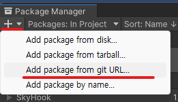

# SkyHook-Unity

SkyHook for Unity

## Installation

1. Open package manager with `Window -> Package Manager`
2. Press `+` button and find `Add package from git URL...`



3. Enter `git+https://git.pikokr.dev/SkyHook/SkyHook-Unity.git` and press `Add` button

## Usage

### Start and stop hook

```cs
SkyHookManager.StartHook(); // Start Hook

SkyHookManager.StopHook(); // Stop Hook, this is automatically called on exit
```

### Receive events

> NOTE: SkyHook does **NOT** give the correct key code. So you can't know what key the user actually pressed.

```cs
SkyHookMnager.KeyUpdated.AddListener(ev => {
  // Your code
});
```
